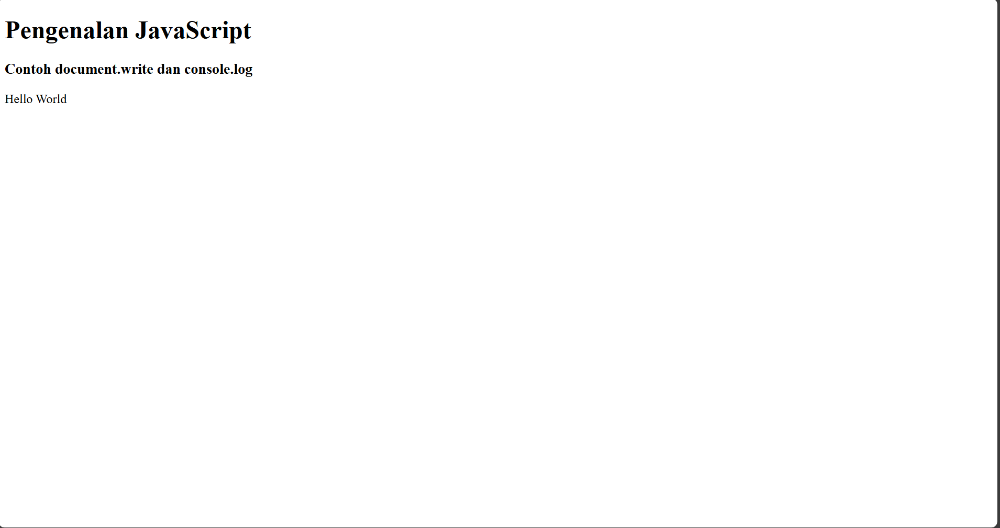
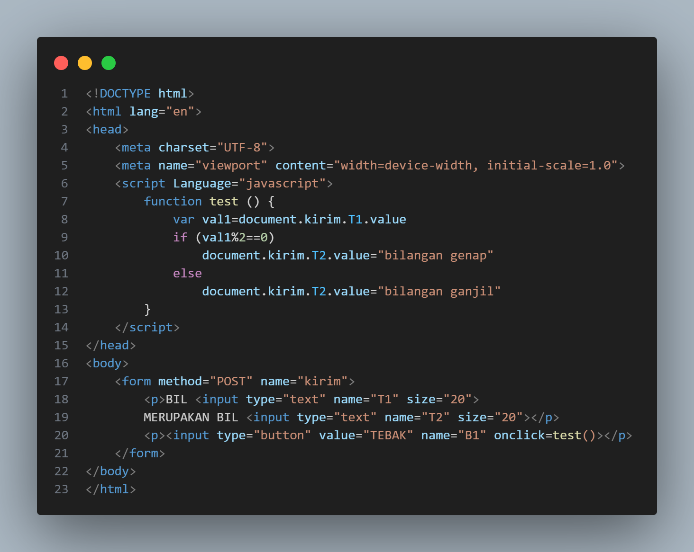

# LAPORAN PRAKTIKUM 5
DAFTAR ISI
==========
- [LAPORAN PRAKTIKUM 5](#laporan-praktikum-5) 
    - [TUJUAN PRAKTIKUM](#tujuan-praktikum)
    - [LANGKAH - LANGKAH MEMBUAT JAVA SCRIPT](#langkah-langkah-membuat-java-script)
    - [KESIMPULAN](#kesimpulan)

## TUJUAN PRAKTIKUM
Tujuan dari praktikum JavaScript ini adalah untuk memahami dan mengimplementasikan dasar-dasar pemrograman JavaScript dalam pembuatan halaman web yang interaktif. Melalui kegiatan praktikum ini, mahasiswa diharapkan mampu mengenal fungsi JavaScript sebagai bahasa pemrograman client-side, memahami struktur dasar penulisan script di dalam HTML, serta menggunakan variabel, operator, dan fungsi untuk mengolah data pada halaman web. Selain itu, mahasiswa juga diharapkan dapat menerapkan konsep event handling seperti penggunaan onclick atau onsubmit untuk menambahkan interaktivitas, melakukan validasi pada form, melakukan perhitungan sederhana, serta memanipulasi objek document agar tampilan web menjadi lebih dinamis dan responsif.

## LANGKAH-LANGKAH MEMBUAT JAVA SCRIPT

### Step 1 Membuat dokumen HTML
membuat dokumen HTML dengan nama file lab5_javascript.html seperti berikut.

# INPUT

# OUTPUT

  

### Step 2 Menambahkan Alert
Setelah itu menambahkan Alert sebagai property window.

# INPUT

# OUTPUT

### Step 3 Menambahkan Method
Kemudian menambahkan method dalam objek

# INPUT

# OUTPUT

### Step 4 Menggunakan Prompt

# INPUT

# OUTPUT

### Step 5 Membuat Fungsi Dan Cara Pemanggilan 

# OUTPUT

### Step 6 Menggunakan Operasi dasar aritmatika

# INPUT

# OUTPUT

### Step 7 Menambahkan If Dan Else

# INPUT

# OUTPUT

### Step 7 Menambahkan If Dan Else

# INPUT

# OUTPUT

### Step 8 Menggunakan operator switch untuk seleksi kondisi

# INPUT

# OUTPUT

### Step 9 Membuat Form Input

# INPUT

# OUTPUT

### Step 10 Menambahkan Form Button

# INPUT

# OUTPUT

### Step 11 Menggunakan checkBox dengan perhitungan otomatis

# INPUT

# OUTPUT

### Step 12 Membuat Validasi isian Form

# INPUT

# OUTPUT

## Kesimpulan
Kesimpulan dari praktikum ini bahwa JavaScript memiliki peran penting dalam membuat halaman web menjadi lebih interaktif dan dinamis. Melalui praktikum ini, mahasiswa dapat memahami cara kerja dasar JavaScript, mulai dari penggunaan variabel, operator, fungsi, hingga penerapan event handling pada elemen HTML. Selain itu, mahasiswa juga mampu membuat program sederhana seperti validasi form dan perhitungan otomatis menggunakan script JavaScript. Dengan demikian, praktikum ini membantu mahasiswa untuk meningkatkan kemampuan logika pemrograman sekaligus memahami bagaimana JavaScript digunakan dalam pengembangan web modern.

